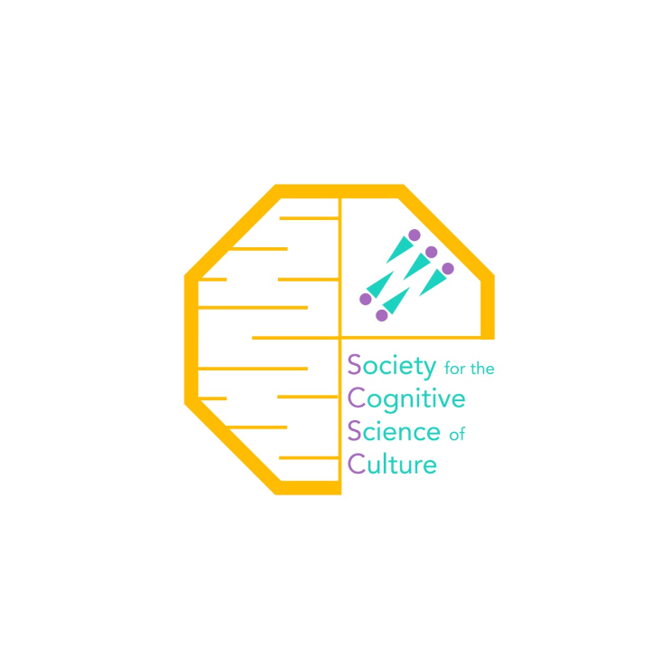

```{=html}
<style type="text/css">
.title {
  display: none;
}

#getting-started img {
  margin-right: 50px;
}

</style>
```
<div class="row" style="padding-top: 30px;">

::: col-sm-6
# **The Society for the Cognitive Science of Culture**

This is the website of the Society for the Cognitive Science of Culture. Currently under construction.
:::

::: col-sm-6
```{=html}
<!--
### [SCSC](https://scsoc.github.io)
-->
```
<a href = "https://scsoc.github.io"> {width="800"} </a>
:::
